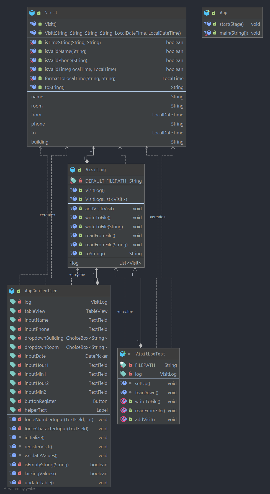

#  Logger, the app

The purpose of the app is to register a user's visits to rooms and see an overview of all their visits with an option to filter and delete visits at their own discretion.

## User stories

- As a user I want to register where I have been using my name and phone number, when I visited and how long
- As a user I want to see former visits, so I can see who have visited a room
- As a user I want to search in former visits, so I can easier find a certain visit
- As a user I want to delete a former visit, so I can remove unwanted visit entries

## Structure and Maven build

The project includes tests for all modules, striving for at least 80% coverage across the board.

The project is configured as a modularized Maven project, where `core` handles domain logic and serializing/local storage, `fxui` handles the user interaction, and `rest` handles remote storage, including a server and API endpoints.

Our Maven-build requires at least Java version 14, and JavaFX version 11.

We use various code quality tools in all modules:

- [JaCoCo Java Code Coverage Library](https://github.com/jacoco/jacoco), to check our tests' code coverage
- [Spotbugs](https://spotbugs.github.io/), to spot bugs
- [Checkstyle](https://checkstyle.sourceforge.io), standardizing our formatting to [Google coding conventions](https://github.com/checkstyle/checkstyle/blob/master/src/main/resources/google_checks.xml)

JaCoCo and Checkstyle will report in .html and the console respectively, at the time of building the app. Spotbugs will stop our build if a bug is spotted. Some modules also uses additional plugins described in their respective documentation.

## Illustrations

## Architecture diagram

<!-- TODO -->

## Class diagram

The PlantUML diagram illustrates the relationship between the classes. We have chosen a hierarchic layout.  

App.java lies besides the structure because it has no form of dependency or relationship with the others. This is because it simply instructs the program to start.

Visit.java, which sits at the top, is the class which formats and creates the visits. Therefore, all other classes depend on this class to create Visit objects.

VisitLog.java keeps track of all the visits in one log. It has the functionality of adding visits and reading/writing to file.

AppController.java plays the role of combining all the functionality of the application and connecting it to the FXML interface.

Furthermore, the controller has the full set of input fields declared as FXML variables. Therefore, to access the fields, you have to use the controller. Other features of the controller are validation and checks for the input fields. This ensures that no matter the user input, the program has a way of recognizing its validity and dealing with potential errors. Lastly, it is the controller that creates both the instance of Visit and VisitLog. AppController.java is solely dependent on VisitLog to exist and work for the test to run. This is also true for the VisitLogTest class. VisitLog is further dependent on the Visit class.

On a conceptual level you could say that you need the concept of visits to comprehend the idea of a visit log. The controller and the test class also depends on this as they directly work by using the Visit log, which uses Visit.
