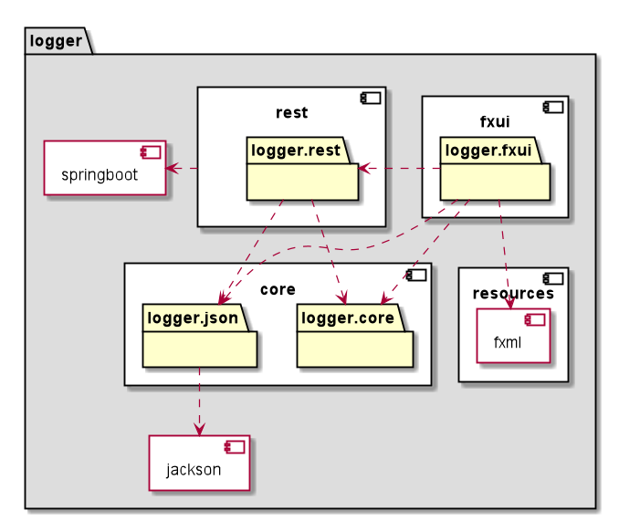

#  Logger, the app

The purpose of the app is to register a user's visits to rooms and see an overview of all their visits with an option to filter and delete visits at their own discretion.

## User stories

- As a user I want to register where I have been using my name and phone number, when I visited and how long
- As a user I want to see former visits, so that I can see who have visited a room or a building
- As a user I want to be able to sort a list of visits by different criteria such as earliest date or alphabetical order.
- As a user I want to search for visit based on all fields, such as phone number, date of visit and building, so that I can find specific visits
- As a user I want to delete a former visit, so that I can remove unwanted visit entries

## Structure and Maven build

The project includes tests for all modules, striving for at least 80% coverage across the board.

The project is configured as a modularized Maven project, where `core` handles domain logic and serializing/local storage, `fxui` handles the user interaction, and `rest` handles remote storage, including a server and API endpoints.

Our Maven-build requires at least Java version 14, and JavaFX version 11.

We use various code quality tools in all modules:

- [JaCoCo Java Code Coverage Library](https://github.com/jacoco/jacoco), to check our tests' code coverage
- [Spotbugs](https://spotbugs.github.io/), to spot bugs
- [Checkstyle](https://checkstyle.sourceforge.io), standardizing our formatting to [Google coding conventions](https://github.com/checkstyle/checkstyle/blob/master/src/main/resources/google_checks.xml)

JaCoCo and Checkstyle will report in .html and the console respectively, at the time of building the app. Spotbugs will stop our build if a bug is spotted. Some modules also uses additional plugins described in their respective documentation.

## Illustrations

Here are two screenshots of the application running. Our UI consists of two tabs, one for each feature; registering visits and viewing them.

Here is a view of the registration form:

The image below illustrates the view of the visit log:

## Diagrams

### Package Diagram

Our package diagram shows the connection between packages as well as the modules within them. It also visualizes where we use frameworks.

The fxui contains two data access classes. One for remote and one for local storage. 

* **[RemoteVisitLogDataAccess](logger/fxui/src/main/java/logger/fxui/utils/RemoteVisitLogDataAccess.java)** connects to the rest module when setting up remote storage.
* **[LocalVisitLogDataAccess](logger/fxui/src/main/java/logger/fxui/utils/LocalVisitLogDataAccess.java)** sets up local storage internally.

The fxui also connects the fxml (UI) to the logic layer, which is the core module.

Rest communicates with the core for persistence when handling visits. Examples are when adding and removing visits from the log.

Springboot and Jackson are important dependencies for the project to work. Springboot is used for the server, while Jackson is used for deserializing and serializing.

### Class diagrams

For our class diagrams we have chosen to create one for each package. This is because one single class diagram is not very useful.
Having a class diagram for each package makes it easier to see the connection between classes without too much clutter. When looking at connections across packages, you can use the dedicated package diagram.

### Sequence diagram

