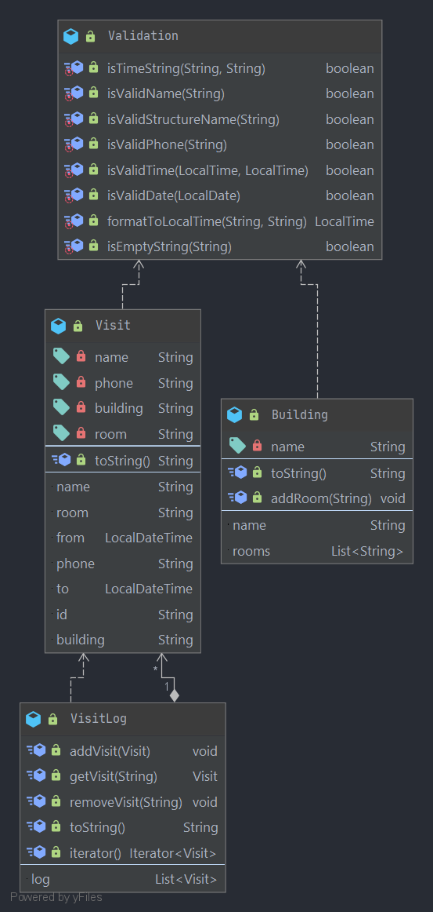

# Source code for core

The domain layer consists of classes to represent buildings and visits, that a VisitLog keeps track of. It also contains validation to validate input to visit, also usable by other modules.

## Class diagram

Class diagrams are found in [logger/diagrams](../../../../../../diagrams/core_class_diagram.png).

### Description

The core module is where the most essential logic for our application lies. It is the logic that ties together the Visits and the Log as well as the validation of input and filtering (search).

VisitLog is a class that contains visits. Its functionality includes:

* Addition of visits (addVisit)
* Removal of visits (removeVisit)
* Retrieval of visits (getVisit)

Visit is the class that we use to create Visit objects. A Visit consists of:

* A name (of the visitor)
* A phone number
* The building which was visited
* The room of the building which was visited

A visit cannot be edited using methods. To change it, one must remove it from the log and then add a new one with the new data.

Validation is a validation class for the UI. In that way it speaks for itself. The methods in it is used to validate inputs. They all return Boolean values (besides the formatToLocalTime).
Building is a class that is used to connect rooms and building is the UI. When choosing a building in the dropdown selector in the registration form of the app, it is the Building class that is used to filter the rooms that will be available to the user.

Filter is the class that makes the search functionality work. It filters by different criteria and only shows the Visits which conforms to them (for example visit date).
